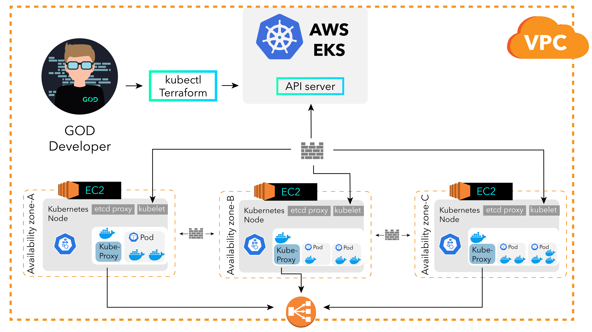

# TERRAFORM-EKS-ENV-WORKSHOP

[](https://github.com/GOD-mbh/terraform-eks-env-workshop/actions)
[](https://github.com/GOD-mbh/terraform-eks-env-workshop/releases)

Terraform and helm charts to ensure deployment of the full EKS cluster

<p align="center">
  
</p>

## Prerequsite

```bash
brew update
brew install kubectl
brew install python3
easy_install pip
pip install awscli — upgrade — user
export PATH=~/.local/bin:$PATH
brew install terraform
brew install terragrunt
brew install direnv
```

### Setup .envrc

Setup your `KUBECONFIG`

```bash
export KUBECONFIG=$(pwd)/eks-vpc/kubeconfig_GOD-EKS
```

### Authorize users to access the cluster

Initially, only the system that deployed the cluster will be able to access the cluster. To authorize other users for accessing the cluster, config needs to be modified by using the steps given below:

* Modify file `eks-vpc/locals.tf`as:


```yaml

locals {

  map_users = [
    {
      userarn  = "arn:aws:iam::${data.aws_caller_identity.current.account_id}:user/tgaleev"
      username = "tgaleev"
      groups   = ["system:masters"]
    }
  ]

  map_roles = []

  map_accounts = []
}
```

## How to use this example

Install EKS

- `cd eks-vpc`
- Run `terraform init`
- Run `terraform plan` and review
- Run `terraform apply`

Install helm charts

- `cd charts`
- Run `terraform init`
- Run `terraform plan` and review
- Run `terraform apply`


## Structure
This repository provides the minimal set of resources, which may be required for starting comfortably developing the process of new IaC project:

  main.tf - data from modules

  modules.tf - list of modules and their redefined values

  providers.tf - list of providers and their values

  variables.tf - variables used in modules. Customize it for your project data !!!

  variables.tf.json - list of versions for variables. Customize it for your project data !!!

## Work with cluster

For destroy some module just remove it from modules.tf and run.

`terraform plan -out plan && terraform apply plan`

## What resources via helm are created

- external-dns
- metrics-server
- ingress-nginx
- cert-manager
- archiva
- sonarqube
- sonatype-nexus
- argo
- weave
- loki
- keycloack
- monitoring (grafana)
- jenkins

### Cleaning up

You can destroy this cluster entirely by running:

```bash
terraform plan -destroy
terraform destroy  --force
```